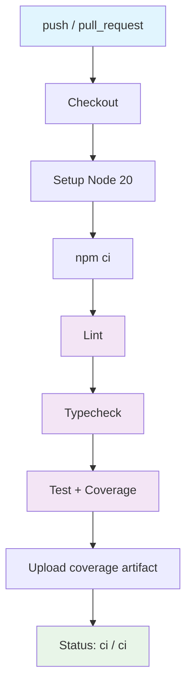

## Workflow Overview

**Purpose**: Verify every push and pull request on `main` / `develop` passes lint, typecheck, test, and coverage gates; publish coverage as an artifact.
**Trigger Events**: `push` to `main` or `develop`; `pull_request` targeting `main` or `develop`.
**Target Environments**: `ubuntu-latest` runners with Node.js 20.

## Execution Flow Diagram



## Jobs & Dependencies

| Job Name | Purpose                                        | Dependencies | Execution Context   |
| -------- | ---------------------------------------------- | ------------ | ------------------- |
| `ci`     | Validate lint, types, tests, coverage gates    | Trigger only | `ubuntu-latest`, Node 20 |

The workflow has a single job named `ci`; its status context as reported to branch protection is `ci / ci`.

## Requirements Matrix

### Functional Requirements

| ID      | Requirement                                                           | Priority | Acceptance Criteria                                             |
| ------- | --------------------------------------------------------------------- | -------- | --------------------------------------------------------------- |
| REQ-001 | Run on every push to `main` / `develop`                                | High     | Workflow triggers automatically; status appears on commit       |
| REQ-002 | Run on every PR targeting `main` / `develop`                           | High     | Status check surfaces in PR; required by branch protection      |
| REQ-003 | Fail build on ESLint errors                                            | High     | Non-zero exit from `npm run lint` fails the job                 |
| REQ-004 | Fail build on TypeScript errors                                        | High     | `tsc --noEmit` non-zero exit fails the job                      |
| REQ-005 | Fail build on any failing test                                         | High     | Vitest non-zero exit fails the job                              |
| REQ-006 | Fail build when coverage drops below 95% aggregate                     | High     | Vitest's built-in threshold fails the job on the last step      |
| REQ-007 | Publish coverage as a downloadable artifact                            | Medium   | `coverage/` uploaded under artifact name `coverage`             |

### Security Requirements

| ID      | Requirement                                         | Implementation Constraint                                                          |
| ------- | --------------------------------------------------- | ---------------------------------------------------------------------------------- |
| SEC-001 | Workflow runs with least privilege                   | `permissions: { contents: read }` at the workflow level                           |
| SEC-002 | Actions pinned to explicit major versions            | `actions/checkout@v4`, `actions/setup-node@v4`, `actions/upload-artifact@v4`      |
| SEC-003 | No secrets are read or exposed                       | No `secrets.*` references exist; workflow is inert to compromised PR branches     |

### Performance Requirements

| ID       | Metric               | Target     | Measurement Method                    |
| -------- | -------------------- | ---------- | ------------------------------------- |
| PERF-001 | Wall-clock duration  | ≤ 120 s    | GitHub Actions job summary timestamp  |
| PERF-002 | Cache-hit dep install | ≤ 30 s     | `setup-node` cache key + npm ci log   |

## Input/Output Contracts

### Inputs

```yaml
# Repository triggers
branches: [main, develop]
```

No environment variables, secrets, or manual inputs are consumed.

### Outputs

```yaml
coverage: artifact            # v8 coverage report (text, html, lcov) retained for 14 days
status: "ci / ci"             # Required by branch protection on main and develop
```

### Secrets & Variables

| Type    | Name | Purpose | Scope |
| ------- | ---- | ------- | ----- |
| —       | —    | —       | —     |

(Intentionally empty — workflow does not consume secrets.)

## Execution Constraints

### Runtime Constraints

- **Timeout**: 10 minutes (`timeout-minutes: 10`).
- **Concurrency**: `ci-${{ github.ref }}` group with `cancel-in-progress: true`; a new push supersedes the previous run on the same ref.
- **Resource Limits**: default GitHub-hosted `ubuntu-latest` allocation.

### Environmental Constraints

- **Runner Requirements**: Ubuntu, x86_64, Node 20 LTS.
- **Network Access**: `registry.npmjs.org` for dependency installation.
- **Permissions**: read-only on repository contents.

## Error Handling Strategy

| Error Type          | Response                    | Recovery Action                                                      |
| ------------------- | --------------------------- | -------------------------------------------------------------------- |
| Lint failure        | Job fails at step `Lint`    | Fix reported ESLint violations locally and push                      |
| Typecheck failure   | Job fails at step `Typecheck` | Fix type errors; run `npm run typecheck` locally before pushing    |
| Test failure        | Job fails at step `Test`    | Fix the failing test; rerun `npx vitest run` locally                 |
| Coverage below 95%  | Job fails at step `Test`    | Add missing tests until aggregate ≥ 95% or raise the threshold in an ADR |
| Network / npm flake | Step fails with install error | Re-run the workflow; caching reduces exposure to transient npm outages |

## Quality Gates

### Gate Definitions

| Gate          | Criteria                                                 | Bypass Conditions         |
| ------------- | -------------------------------------------------------- | ------------------------- |
| Code Quality  | `npm run lint` exits 0                                   | None                      |
| Type Safety   | `npm run typecheck` exits 0                              | None                      |
| Behavior      | `npm run test:coverage` exits 0                          | None                      |
| Coverage      | Vitest aggregate thresholds ≥ 95% (lines/branches/funcs/stmts) | Raise thresholds in a new ADR |

## Monitoring & Observability

### Key Metrics

- **Success Rate**: target 100% on `develop` and `main`.
- **Execution Time**: target < 120 s.
- **Coverage**: track trend via the uploaded `coverage` artifact.

### Alerting

| Condition                  | Severity | Notification Target |
| -------------------------- | -------- | ------------------- |
| Build red on `develop`/`main` | High     | GitHub email to repo admin |

## Integration Points

### External Systems

| System          | Integration Type | Data Exchange         | SLA Requirements                       |
| --------------- | ---------------- | --------------------- | -------------------------------------- |
| npm registry    | Read             | Package metadata + tarballs | 99.9% (upstream)                    |
| GitHub Actions  | Runtime          | Status checks, artifacts | GitHub's Actions SLA                 |

### Dependent Workflows

None at v0.1.0. Future: release workflow will read the same branch protection contract.

## Compliance & Governance

### Audit Requirements

- **Execution Logs**: retained by GitHub for 90 days; not archived elsewhere.
- **Approval Gates**: none (solo kata; branch protection covers PR merges).
- **Change Control**: updates to `ci.yml` go through a PR; update this spec in the same PR.

### Security Controls

- **Access Control**: only repo administrators can bypass branch protection.
- **Secret Management**: n/a (no secrets used).
- **Vulnerability Scanning**: covered by Dependabot (configured separately if/when added).

## Edge Cases & Exceptions

### Scenario Matrix

| Scenario                                       | Expected Behavior                            | Validation Method                                |
| ---------------------------------------------- | -------------------------------------------- | ------------------------------------------------ |
| Push to a non-protected feature branch         | Workflow does **not** run                    | No job visible in Actions tab for that branch    |
| PR opened from a fork                          | Workflow runs with `pull_request` (read-only) | Check Actions tab; ensure no secret access      |
| Package-lock.json absent                       | `npm ci` fails fast                           | Lint/test never run; failure at install step    |

## Validation Criteria

### Workflow Validation

- **VLD-001**: The single job `ci` is listed in GitHub's "Status checks" when configuring branch protection.
- **VLD-002**: Required status check `ci / ci` is present on both `main` and `develop` after Phase 5 of the plan.
- **VLD-003**: Coverage artifact is downloadable from any completed run.

### Performance Benchmarks

- **PERF-001**: Median wall-clock duration over the last 10 runs ≤ 120 s.
- **PERF-002**: Install step ≤ 30 s on warm npm cache.

## Change Management

### Update Process

1. **Specification Update**: edit this file in the same PR that edits `ci.yml`.
2. **Review & Approval**: merge via PR into `develop`.
3. **Implementation**: apply changes to `ci.yml`.
4. **Testing**: the PR itself exercises the new workflow.
5. **Deployment**: a release PR promotes `develop` → `main`.

### Version History

| Version | Date       | Changes                 | Author             |
| ------- | ---------- | ----------------------- | ------------------ |
| 1.0     | 2026-04-22 | Initial specification   | Sebastián Bello    |

## Related Specifications

- [ADR-0010: CI Pipeline](../docs/adr/adr-0010-ci-pipeline.md)
- [ADR-0009: Branching and Protection](../docs/adr/adr-0009-branching-and-protection.md)
- [ADR-0005: Testing Framework (Vitest)](../docs/adr/adr-0005-testing-framework-vitest.md)
